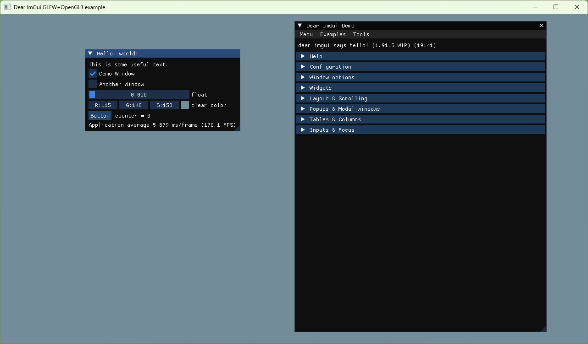

# ImGui Template

## introduce
A xmake project use imgui, glfw and opengl3 with mingw in windows.
一个使用xmake管理的imgui项目模板。


---

## environment
1. os: Windows 11 23H2
2. gcc: 14.2.0
3. xmake: v2.9.5+master.dab3f1080

---

## tree
### glfw tree/glfw目录结构
``` cmd
│  LICENSE.md
│
├─include
│  └─GLFW
│          glfw3.h
│          glfw3native.h
│
└─lib
        glfw3.dll
        libglfw3.a
        libglfw3dll.a
```

### imgui tree/imgui目录结构
``` cmd
│  LICENSE.txt
│
├─include
│      imconfig.h
│      imgui.h
│      imgui_impl_glfw.h
│      imgui_impl_opengl3.h
│      imgui_impl_opengl3_loader.h
│      imgui_internal.h
│      imstb_rectpack.h
│      imstb_textedit.h
│      imstb_truetype.h
│
└─src
        imgui.cpp
        imgui_demo.cpp
        imgui_draw.cpp
        imgui_impl_glfw.cpp
        imgui_impl_opengl3.cpp
        imgui_tables.cpp
        imgui_widgets.cpp
```
## xmake setting
`xmake.lua`:
``` lua
add_rules("mode.debug", "mode.release")

target("glfw_imgui_mingw")
    set_kind("binary")
    -- 设置C/C++标准
    set_languages("c17", "cxx17")
    -- 设置MingW64编译器
    set_toolchains("mingw")
    -- 添加源文件路径，包括imgui源文件
    add_files("src/*.cpp", "lib/imgui/src/*.cpp")
    -- 添加glfw、imgui头文件
    add_includedirs("lib/glfw/include", "lib/imgui/include")
    -- 添加glfw库文件
    add_linkdirs("lib/glfw/lib")
    -- 链接库
    add_links("glfw3", "opengl32","user32","Gdi32","Shell32")
```
